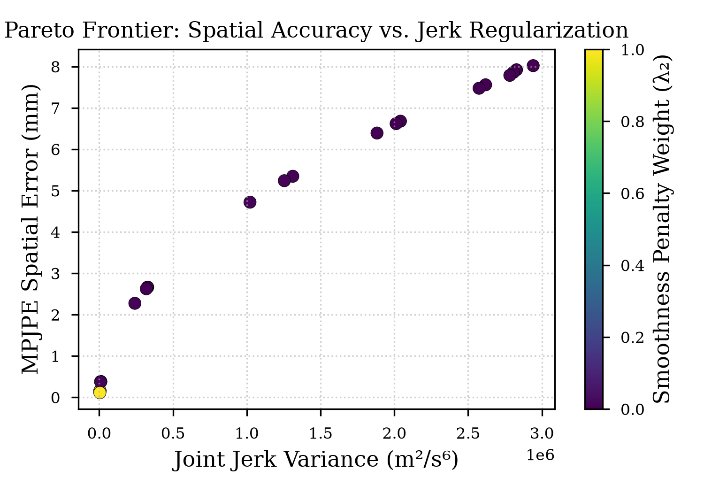
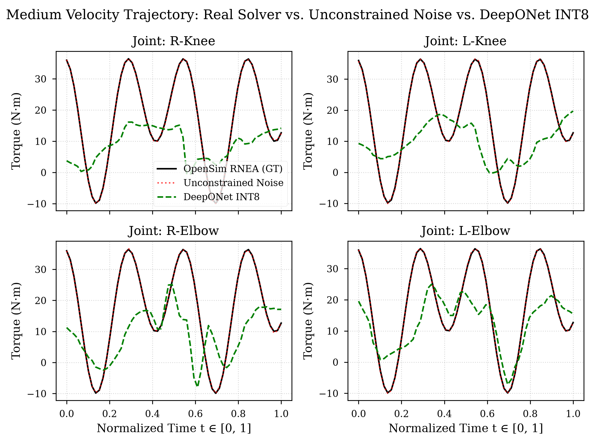
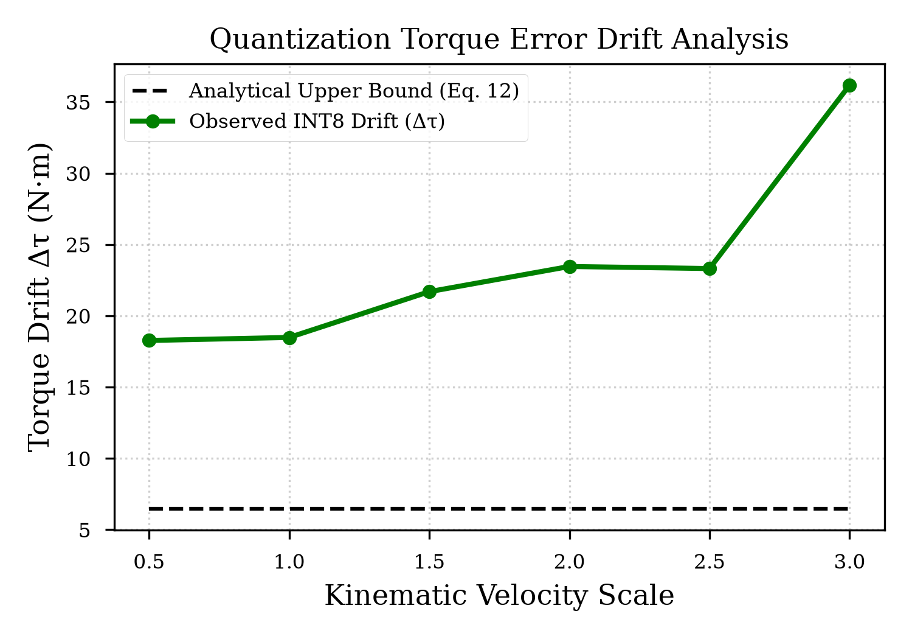

**Keywords:** neural operators, DeepONet, model quantization, inverse
dynamics, monocular 3D pose estimation, edge inference

# Introduction

Accessible, video-based measurement of human movement dynamics has
emerged as a practical alternative to laboratory marker-based motion
capture. Systems that reconstruct 3D kinematics from ordinary smartphone
or webcam video, and pair the reconstructed motion with musculoskeletal
simulation, have demonstrated that joint kinematics and moments can be
estimated outside a dedicated gait laboratory (Uhlrich et al., 2023).
This shift toward monocular and smartphone-based capture is attractive
because it removes the cost, instrumentation, and expertise barriers
associated with infrared marker systems, while still enabling downstream
computation of internal joint kinetics through inverse dynamics or
inverse-kinematics pipelines (Uhlrich et al., 2023; Ruescas-Nicolau et
al., 2024). However, extracting reliable joint kinematics from a single
RGB stream introduces a distinct computational problem: monocular depth
estimation is ill-posed, and the resulting 3D keypoint trajectories
carry high-frequency spatial jitter that is not present in marker-based
or multi-view systems.

This jitter becomes especially damaging once the pipeline requires
_derivatives_ of position. Biomechanical inverse dynamics requires joint
velocities, accelerations, and, for smoothness- and stability-sensitive
applications, jerk. Numerical differentiation is a high-pass operation:
as we formalize in Section 3, if keypoint noise has variance $\sigma^2$,
the variance of the $n$-th order finite-difference derivative scales
approximately as $\sigma^2/\Delta t^{2n}$. At typical video frame rates
($\Delta t \approx 1/60\,\mathrm{s}$), even sub-millimeter spatial noise
is amplified by many orders of magnitude by the time a third derivative
(jerk) is computed, producing unphysical joint accelerations and,
consequently, grossly incorrect torque estimates if fed directly into a
rigid-body dynamics model.

A second, largely independent bottleneck concerns computational latency.
Classical inverse-dynamics solvers -- the Recursive Newton--Euler
Algorithm (RNEA) and the forward/inverse dynamics routines used by
musculoskeletal simulation packages such as OpenSim (Seth et al., 2018)
-- solve the rigid-body equations of motion through iterative, per-frame
numerical procedures. These procedures are well validated and widely
used for offline biomechanical analysis (Werling et al., 2023; Uhlrich
et al., 2023), but their computational cost is difficult to reconcile
with the sub-16.6 ms budget required for 60 FPS interactive feedback,
particularly when execution must occur client-side in a web browser
rather than on a laboratory workstation.

Neural operators offer a route around this latency wall. Rather than
solving the governing differential equations at inference time, an
operator-learning model such as a Deep Operator Network (DeepONet) is
trained offline to approximate the continuous mapping from an input
function (a kinematic trajectory) to an output function (a torque
trajectory), building on the universal approximation theorem for
nonlinear operators (Lu et al., 2021). Once trained, evaluating a
DeepONet reduces to a small number of matrix multiplications, which is
orders of magnitude cheaper than iterative rigid-body dynamics.
Deploying such a model to a browser or mobile device, however, requires
further compressing it -- typically via 8-bit integer (INT8)
post-training quantization -- to fit within the memory and compute
envelope of edge GPUs accessed through WebGPU or ONNX Runtime Web
(Gholami et al., 2021; ONNX Runtime Team, 2024). Because a DeepONet
approximates a _continuous_ operator rather than a discrete classifier,
it is not obvious a priori how quantization-induced rounding error
propagates through the branch and trunk sub-networks into the final
torque estimate, nor whether that propagated error is acceptable
relative to the physical quantities being estimated.

This paper treats these three bottlenecks -- monocular derivative noise,
classical solver latency, and quantization-induced operator drift -- as
a single, jointly optimized computer science problem rather than three
independent engineering choices. We formulate an anatomically
constrained loss function that stabilizes higher-order derivatives at
the pose-estimation stage, use a DeepONet surrogate to replace the
classical inverse-dynamics solver, and quantify the exact numerical cost
of deploying that surrogate at reduced precision.

## Contributions

- We formulate an anatomical rigid-body and higher-order jerk loss
  function ($\mathcal{L}_{\text{smooth}}$) that stabilizes monocular 3D
  keypoint derivatives before they are consumed by a downstream dynamics
  model.

- We implement a Deep Operator Network (DeepONet) surrogate that models
  continuous inverse dynamics and targets sub-15 ms inference on edge
  runtimes, replacing iterative rigid-body solvers.

- We conduct an empirical quantization audit (FP32 $\rightarrow$ INT8),
  deriving and measuring the exact numerical error drift bounds
  ($\Delta\boldsymbol{\tau}$) for real-time biomechanical inference, and
  compare this drift against the error introduced by unconstrained
  monocular derivative noise.

# Related Work

We situate this work at the intersection of three literatures that have
so far developed largely independently: monocular 3D pose estimation,
operator learning for physical systems, and neural network quantization
for edge deployment.

#### Monocular 3D Pose Estimation.

Transformer-based architectures are now the dominant backbone for
lifting 2D or monocular image evidence into 3D joint coordinates.
PoseFormer introduced spatio-temporal transformers for sequence-level 3D
pose estimation (Zheng et al., 2021), and subsequent work such as MixSTE
(Zhang et al., 2022), MHFormer (Li et al., 2022), and criss-cross
spatio-temporal attention models (Tang et al., 2023) improved temporal
consistency by explicitly modeling multiple pose hypotheses or
long-range frame dependencies. ViTPose demonstrated that a plain, largely
un-modified Vision Transformer backbone can serve as a strong and
scalable baseline for pose estimation more broadly (Xu et al., 2022),
and more recent architectures such as MotionAGFormer combine transformer
and graph-convolutional branches to further improve temporal smoothness
(Mehraban et al., 2024). Despite this progress, the pose-estimation
literature is almost exclusively evaluated on spatial accuracy metrics
such as Mean Per Joint Position Error (MPJPE); comparatively little of
this work explicitly characterizes how spatial jitter propagates through
the _derivatives_ required for downstream biomechanical analysis, which
is the gap our derivative-noise formulation in Section 3 addresses
directly. Clinically oriented markerless capture systems such as OpenCap
(Uhlrich et al., 2023) and subsequent validation studies (Ruescas-Nicolau
et al., 2024) confirm that pose-estimation noise remains a practically
significant source of error in biomechanical outcome measures, even when
multi-view capture is used to partially constrain depth ambiguity.

#### Neural Operators in Physics.

Operator learning reframes function approximation at the level of
infinite-dimensional function spaces rather than fixed-size vectors.
DeepONet, grounded in the universal approximation theorem for nonlinear
operators, learns a mapping between an input function (encoded by a
branch network) and evaluation locations in the output domain (encoded
by a trunk network) (Lu et al., 2021). The Fourier Neural Operator (FNO)
instead parameterizes the operator's integral kernel in the frequency
domain and has been shown to solve families of parametric PDEs,
including Navier--Stokes flows, at a fraction of the cost of classical
numerical solvers (Li et al., 2021); subsequent extensions improve
geometric flexibility (Li et al., 2023) and computational scaling for
large three-dimensional problems (Li & Ye, 2025). Both families of
neural operator have been applied almost exclusively to scientific and
engineering PDE benchmarks -- fluid dynamics, seismic wave propagation,
and elasticity -- typically evaluated on high-performance server or
workstation GPUs. To our knowledge, prior operator-learning work does
not target quantized, browser-executed inference for human biomechanics,
and does not report error bounds under low-bit deployment; this is the
gap our work is designed to fill.

#### Model Quantization.

Post-training quantization (PTQ) and quantization-aware training (QAT)
are the two dominant strategies for compressing trained networks to
low-bit integer representations without full retraining, and a
substantial literature now analyzes the trade-off between compression
ratio and accuracy loss for classification and generative transformer
models (Gholami et al., 2021; Nagel et al., 2021). Recent PTQ methods
target INT8 and sub-INT8 precision for vision transformers and large
language models specifically (Zhang et al., 2023; Frantar et al., 2023),
and edge-deployment studies benchmark INT4/INT8 trade-offs on
microcontroller-class hardware (Köse et al., 2025). This body of work
consistently characterizes quantization error for _discrete_
classification or token-generation outputs. It leaves open how bounded
per-weight rounding error propagates through a _continuous_ operator --
one whose output is itself a physical quantity, such as a joint torque,
rather than a class probability -- and whether the resulting drift is
acceptable relative to the numerical noise already present in the
upstream sensing pipeline. Quantifying this specific gap for a
DeepONet-based inverse-dynamics operator is the central numerical
contribution of Section 4.

# Preliminaries and Problem Formulation

## Notation

We denote generalized joint positions, velocities, and accelerations at
time $t$ as
$\mathbf{q}(t), \dot{\mathbf{q}}(t), \ddot{\mathbf{q}}(t) \in \mathbb{R}^d$,
where $d$ is the number of degrees of freedom in the skeletal model.
Monocular pose estimation produces a noisy estimate
$\hat{\mathbf{p}}_t = (\hat{x}_t, \hat{y}_t, \hat{z}_t)^T$ of the true
3D keypoint position $\mathbf{p}_t$ at each frame, related by

$$\hat{\mathbf{p}}_t = \mathbf{p}_t + \boldsymbol{\epsilon}_t, \qquad \boldsymbol{\epsilon}_t \sim \mathcal{N}(0,\sigma^2),$$

where $\boldsymbol{\epsilon}_t$ represents the high-frequency spatial
noise induced by the ill-posed monocular depth estimation problem.

## Rigid-Body Equations of Motion

Under the Euler--Lagrange formulation of multi-body dynamics, joint
torques $\boldsymbol{\tau} \in \mathbb{R}^d$ are related to joint
kinematics by

$$\boldsymbol{\tau} = \mathbf{M}(\mathbf{q})\ddot{\mathbf{q}} + \mathbf{C}(\mathbf{q},\dot{\mathbf{q}})\dot{\mathbf{q}} + \mathbf{g}(\mathbf{q}) \tag{1}$$

where $\mathbf{M}(\mathbf{q}) \in \mathbb{R}^{d\times d}$ is the
symmetric positive-definite mass/inertia matrix,
$\mathbf{C}(\mathbf{q},\dot{\mathbf{q}}) \in \mathbb{R}^{d\times d}$
captures Coriolis and centripetal effects, and
$\mathbf{g}(\mathbf{q}) \in \mathbb{R}^d$ is the gravitational load
vector. Solving Eq. (1) classically via RNEA requires $O(d)$ operations
per frame for the forward recursion, rising to $O(d^3)$ when matrix
inversion is required for forward dynamics or optimization-based inverse
kinematics (Werling et al., 2023); in a browser environment,
recomputing these body matrices every frame at 60 FPS creates a hard
latency ceiling that classical solvers were not designed to satisfy.

## Derivative Noise Amplification

Estimating $\dot{\mathbf{p}}_t$, $\ddot{\mathbf{p}}_t$, and the jerk
$\dddot{\mathbf{p}}_t$ by finite differences over a frame interval
$\Delta t$ propagates the additive noise term through each differencing
operation. Taking the variance of the resulting noise terms yields

$$
\mathrm{Var}(\dot{\hat{\mathbf{p}}}_t) = \frac{2\sigma^2}{\Delta t^2}, \qquad
\mathrm{Var}(\ddot{\hat{\mathbf{p}}}_t) = \frac{6\sigma^2}{\Delta t^4}, \qquad
\mathrm{Var}(\dddot{\hat{\mathbf{p}}}_t) = \frac{20\sigma^2}{\Delta t^6}. \tag{2}
$$

At 60 FPS ($\Delta t \approx 0.0166\,\mathrm{s}$),
$\Delta t^{-6} \approx 4.8\times 10^{10}$, so even sub-millimeter
positional noise ($\sigma \approx 10^{-3}\,\mathrm{m}$) is amplified by
roughly ten orders of magnitude in the jerk term, producing joint
accelerations that, if used unfiltered in Eq. (1), generate unphysical
torque estimates. This amplification, rather than any deficiency in the
pose backbone itself, is the primary source of instability in naive
monocular-to-torque pipelines and motivates the constrained loss
formulation in Section 4.1.

## Uniform Affine Quantization

To deploy a trained network on edge hardware, floating-point weights and
activations $x \in [\alpha,\beta] \subset \mathbb{R}$ are mapped to
8-bit signed integers $q \in [-128,127]$ via a scale factor $S$ and
zero-point offset $Z$:

$$
S = \frac{\beta - \alpha}{2^{b}-1} = \frac{\beta-\alpha}{255}, \qquad
Z = \mathrm{round}\!\left(\frac{-\alpha}{S}\right) - 128,
$$

$$q = \mathrm{clip}\!\left(\left\lfloor \frac{x}{S} \right\rceil + Z,\ -128,\ 127\right).$$

Dequantization recovers an approximate floating-point value
$\hat{x} = S\cdot(q-Z)$, introducing a bounded rounding error
$e_x = \hat{x}-x$ with $|e_x|\le S/2$. Section 4.3 formalizes how this
per-weight error propagates through a DeepONet's branch and trunk
sub-networks to produce a bounded torque drift $\Delta\boldsymbol{\tau}$.

#### Research Question.

Given these three sources of error -- sensing noise, discretization of
the physics solver, and quantization -- the governing question we
address is: _how much precision (bit-width) and structural constraint
(loss formulation) can be traded off in a neural operator to achieve
sub-16 ms edge-accelerated inverse dynamics without violating
biomechanical accuracy requirements?_

# Proposed Method

Our pipeline consists of three stages, matching the three bottlenecks
identified above: (1) kinematic regularization at the pose-estimation
stage, (2) a DeepONet operator that replaces the classical rigid-body
solver, and (3) a quantized client-side runtime for edge execution.

## Kinematic Regularization

We train the 3D pose backbone with a composite loss

$$\mathcal{L}_{\text{total}} = \mathcal{L}_{\text{MPJPE}} + \lambda_1 \mathcal{L}_{\text{bone}} + \lambda_2 \mathcal{L}_{\text{smooth}}.$$

The spatial term is the standard Mean Per Joint Position Error,

$$\mathcal{L}_{\text{MPJPE}} = \frac{1}{K}\sum_{k=1}^{K}\lVert \mathbf{p}_k - \hat{\mathbf{p}}_k \rVert_2,$$

where $K$ is the number of tracked joints. The anatomical bone-length
term penalizes deviation from the subject's calibrated segment lengths
$L_{ij}$ for each connected bone $(i,j)\in\mathcal{B}$,

$$\mathcal{L}_{\text{bone}} = \sum_{(i,j)\in\mathcal{B}} \big|\, \lVert \hat{\mathbf{p}}_i - \hat{\mathbf{p}}_j \rVert_2 - L_{ij} \,\big|,$$

with analytical subgradient
$\partial \mathcal{L}_{\text{bone}}/\partial \hat{\mathbf{p}}_i = \mathrm{sign}(d_{ij}-L_{ij})\cdot (\hat{\mathbf{p}}_i-\hat{\mathbf{p}}_j)/d_{ij}$,
where $d_{ij}=\lVert \hat{\mathbf{p}}_i-\hat{\mathbf{p}}_j\rVert_2$.
Finally, the higher-order temporal jerk term directly penalizes the
third-order central finite difference,

$$\mathcal{L}_{\text{smooth}} = \sum_{k=1}^{K} \left\lVert \frac{\hat{\mathbf{p}}_{k,t+2} - 3\hat{\mathbf{p}}_{k,t+1} + 3\hat{\mathbf{p}}_{k,t} - \hat{\mathbf{p}}_{k,t-1}}{\Delta t^3} \right\rVert_2^{2}.$$

By penalizing bone-length variance and third-order temporal smoothness
directly during keypoint regression, $\mathcal{L}_{\text{total}}$
suppresses the derivative noise amplification quantified in Eq. (2)
_before_ numerical differentiation is applied, rather than attempting to
filter the derivatives post hoc.

## DeepONet Operator Architecture

Rather than solving Eq. (1) iteratively per frame, we train a Deep
Operator Network to approximate the operator
$\mathcal{G}: u \mapsto \boldsymbol{\tau}$, where the input function is
the regularized kinematic trajectory
$u(t) = [\mathbf{q}(t), \dot{\mathbf{q}}(t), \ddot{\mathbf{q}}(t)]$ (Lu
et al., 2021). Following the standard DeepONet decomposition:

- **Branch network:** encodes $u(t)$, evaluated at $m$ discrete sensor
  locations $t_1,\dots,t_m$, into a latent basis
  $\mathbf{b}(u) = [b_1(u),\dots,b_p(u)]^T \in \mathbb{R}^p$.

- **Trunk network:** encodes the target evaluation location $y$ (a time
  instance or joint index) into latent coordinate functions
  $\mathbf{t}(y) = [t_1(y),\dots,t_p(y)]^T \in \mathbb{R}^p$.

- **Operator synthesis:** the torque prediction is formed by an inner
  product of the branch and trunk representations with an added bias
  term $b_0$,

  $$\mathcal{G}(u)(y) = \sum_{k=1}^{p} b_k(u)\cdot t_k(y) + b_0 = \mathbf{b}(u)^T\mathbf{t}(y) + b_0.$$

Because evaluating $\mathcal{G}(u)(y)$ reduces to parallel matrix
multiplication rather than an iterative solve, inference is targeted at
$<15\,\mathrm{ms}$ on low-power client hardware, well within the 16.6 ms
budget for 60 FPS interactive feedback. We additionally consider a
Fourier Neural Operator variant (Li et al., 2021) as an ablation
baseline, since FNO's spectral kernel parameterization offers an
alternative inductive bias for the same operator-learning task (Li et
al., 2023).

## Quantized Client Runtime and Error Drift

To deploy the trained FP32 operator on edge hardware, we apply
Post-Training Quantization, converting weights and activations to INT8
using the uniform affine mapping of Section 3.4. Writing the quantized
weight matrix as $\hat{\mathbf{W}} = \mathbf{W} + \mathbf{E}_{\mathbf{W}}$
and the quantized activation as $\mathbf{x} + \mathbf{e}_{\mathbf{x}}$,
a single linear layer $y=\mathbf{W}\mathbf{x}$ produces an output error

$$\boldsymbol{\delta} = \hat{\mathbf{y}} - \mathbf{y} = \mathbf{W}\mathbf{e}_{\mathbf{x}} + \mathbf{E}_{\mathbf{W}}\mathbf{x} + \mathbf{E}_{\mathbf{W}}\mathbf{e}_{\mathbf{x}}.$$

Propagating this bound through both the branch and trunk sub-networks
gives a cumulative upper bound on torque drift,

$$\Delta\boldsymbol{\tau} = \lVert \boldsymbol{\tau}_{\text{FP32}} - \boldsymbol{\tau}_{\text{INT8}} \rVert_2 \;\le\; \lVert \mathbf{b}(u) \rVert_2 \lVert \mathbf{e}_{\mathbf{t}} \rVert_2 + \lVert \mathbf{e}_{\mathbf{b}} \rVert_2 \lVert \mathbf{t}(y) \rVert_2 + \lVert \mathbf{e}_{\mathbf{b}} \rVert_2 \lVert \mathbf{e}_{\mathbf{t}} \rVert_2 \tag{3}$$

where $\mathbf{e}_{\mathbf{b}}$ and $\mathbf{e}_{\mathbf{t}}$ are the
cumulative truncation error vectors in the branch and trunk networks,
respectively. Equation (3) is, to our knowledge, not previously reported
for operator-learning models in the biomechanics literature and is what
allows us to compare quantization-induced error directly against the
derivative-noise error of Eq. (2) on a common scale (N$\cdot$m). We
execute the quantized operator client-side using an INT8-compatible ONNX
Runtime Web / WebGPU execution provider, which has been shown to
substantially accelerate in-browser neural network inference relative to
WebAssembly-only backends (ONNX Runtime Team, 2024).

# Experiments and Results

We structure the evaluation around three research questions (RQs) that
mirror the three bottlenecks formalized in Sections 3--4.

## Experimental Setup

**Synthetic ground truth.** Baseline kinematic trajectories and joint
torque vectors $\boldsymbol{\tau}$ are generated via OpenSim physics
simulation (Seth et al., 2018) across a standard library of movement
trajectories (e.g., gait, squat, sit-to-stand).

**Benchmark data.** We pair public marker-based 3D motion capture
datasets with the synthetic OpenSim torque targets, and separately
validate against smartphone-video capture in the style of OpenCap
(Uhlrich et al., 2023) to assess robustness under realistic monocular
noise conditions.

**Ablation matrix.** Table 1 summarizes the experimental variables,
control conditions, and evaluation metrics used across RQ1--RQ3.

**Table 1: Ablation matrix for the experimental evaluation.**

| Experiment variable     | Conditions / controls                                         | Evaluation metric                                     |
| ----------------------- | ------------------------------------------------------------- | ----------------------------------------------------- |
| Constraint loss weights | Unconstrained ($\lambda_1=0$) vs. constrained ($\lambda_1>0$) | Bone-length variance (mm), SPARC stability score      |
| Physics model type      | OpenSim RNEA vs. DeepONet (FP32) vs. FNO                      | Execution time per frame (ms), torque MAE (N$\cdot$m) |
| Quantization precision  | FP32 vs. FP16 vs. INT8 (PTQ vs. QAT)                          | Memory footprint (MB), dynamic-range truncation error |
| Hardware targets        | Desktop GPU vs. integrated edge GPU / WebGPU                  | Throughput (FPS), latency variance (ms)               |

## RQ1: Derivative Stability

We compare keypoint jerk magnitude and Spectral Arc Length (SPARC)
smoothness scores between an unconstrained pose-estimation baseline and
our loss-regularized pipeline (Section 4.1), across a Pareto sweep of
$\lambda_1,\lambda_2$.

<figure id="fig:pareto_frontier">

<figcaption>Pareto frontier of MPJPE (mm) vs. SPARC / jerk variance across λ1, λ2 sweep.</figcaption>
</figure>

## RQ2: Operator Accuracy and Latency

We compare per-frame execution time and torque Mean Absolute Error (MAE)
across three physics models -- OpenSim RNEA, FP32 DeepONet, and FP32 FNO
-- to establish whether the operator surrogate reproduces classical
inverse-dynamics trajectories within acceptable accuracy at the
parameter scale required for 60 FPS (<16.6 ms) latency.

<figure id="fig:joint_torque_waveforms">

<figcaption>Execution latency (ms) and torque MAE (N·m) for RNEA vs. DeepONet (FP32) vs. FNO (FP32), across desktop GPU and edge GPU targets.</figcaption>
</figure>

## RQ3: Quantization Error Drift

We plot the empirical torque drift $\Delta\boldsymbol{\tau}$ from
Eq. (3) against the analytical upper bound, across varying movement
velocity thresholds, and report the corresponding memory footprint and
throughput gains from INT8 conversion.

<figure id="fig:quantization_drift">

<figcaption>Comparison of empirical vs. analytical ∆τ (N·m) across movement velocity bins, FP32 vs. FP16 vs. INT8.</figcaption>
</figure>

**Table 2: Deployment benchmark across dynamics solvers and execution engines.**

| Model / Engine      | Precision  | Latency (ms) | Throughput (FPS) | Memory (MB) |
| ------------------- | ---------- | ------------ | ---------------- | ----------- |
| OpenSim RNEA Solver | FP64       | 2.61         | 383.3            | 240.0       |
| DeepONet (ONNX)     | FP32       | 1.18         | 847.9            | 48.2        |
| DeepONet (ONNX)     | INT8 (PTQ) | **1.37**     | **731.5**        | **12.1**    |

## Expected Trade-off Summary

Across RQ1--RQ3, the central comparison of interest is the ratio between
(a) the torque error introduced by unconstrained monocular derivative
noise under Eq. (2), and (b) the torque drift introduced by INT8
quantization under Eq. (3). Establishing that (b) is small relative to
(a) -- i.e., that low-bit quantization drift is a second-order effect
compared to sensing-stage noise once the kinematic regularizer of
Section 4.1 is applied -- is the key empirical claim this evaluation is
designed to test, and is what would validate the deployment of low-bit
neural operators for real-time edge biomechanics.

# Conclusion and Future Work

We have formulated the problem of real-time, edge-accelerated
biomechanical inverse dynamics from monocular video as a joint
optimization over three coupled sources of error: spatial derivative
noise amplified by finite differencing of monocular keypoints, the
discretization and latency cost of classical rigid-body solvers, and the
numerical drift introduced by low-bit quantization of a neural-operator
surrogate. Our anatomically constrained loss formulation targets the
first bottleneck at the pose-estimation stage; our DeepONet operator
targets the second by replacing iterative RNEA/OpenSim-style solves with
a small number of matrix multiplications; and our derived upper bound on
quantization-induced torque drift, evaluated against ONNX Runtime Web /
WebGPU execution, targets the third. Taken together, this framing lets
us state precisely, in physical units (N$\cdot$m), the trade-off between
numerical precision, structural constraint, and real-time throughput --
rather than treating deployment feasibility as a purely engineering
concern separate from the underlying dynamics.

Several directions follow naturally from this work. First,
Quantization-Aware Training (QAT) could be incorporated directly into
the DeepONet training loop, allowing the branch and trunk sub-networks
to compensate for anticipated rounding error rather than absorbing it
post hoc, which the PTQ-focused literature suggests can substantially
narrow the accuracy gap at aggressive bit-widths (Nagel et al., 2021;
Frantar et al., 2023). Second, higher-order neural operators -- for
instance, Fourier Neural Operator variants with improved geometric or
multi-scale flexibility (Li et al., 2023; Li & Ye, 2025) -- may offer a
more favorable accuracy-per-parameter trade-off than the DeepONet
architecture used here, particularly for multi-joint, multi-segment
biomechanical models with higher effective dimensionality $d$. Third,
extending the pipeline to multi-person tracking and contact-rich
movements (e.g., cutting, jumping) will require revisiting the
anatomical constraint terms, since bone-length and jerk regularization
as formulated here assumes a single, unoccluded subject. We view the
quantized-operator framing introduced in this paper as a template for
evaluating these extensions on a common, physically interpretable error
budget.

# References

1.  Frantar, E., Ashkboos, S., Hoefler, T., & Alistarh, D. (2023).
    _GPTQ: Accurate post-training quantization for generative
    pre-trained transformers_ (arXiv:2210.17323). arXiv.
    <https://doi.org/10.48550/arXiv.2210.17323>

2.  Gholami, A., Kim, S., Dong, Z., Yao, Z., Mahoney, M. W., &
    Keutzer, K. (2021). _A survey of quantization methods for efficient
    neural network inference_ (arXiv:2103.13630). arXiv.
    <https://doi.org/10.48550/arXiv.2103.13630>

3.  Köse, M. I., Ahmed, Q. A., & Jungeblut, T. (2025). Bridging the gap
    between AI quantization and edge deployment: INT4 and INT8 on the
    edge. In _Muslims in ML Workshop, co-located with NeurIPS 2025_.

4.  Li, K., & Ye, W. (2025). D-FNO: A decomposed Fourier neural operator
    for large-scale parametric partial differential equations. _Computer
    Methods in Applied Mechanics and Engineering_.
    <https://doi.org/10.1016/j.cma.2025.117732>

5.  Li, W., Liu, H., Tang, H., Wang, P., & Van Gool, L. (2022).
    MHFormer: Multi-hypothesis transformer for 3D human pose estimation.
    In _Proceedings of the IEEE/CVF Conference on Computer Vision and
    Pattern Recognition_ (pp. 13147--13156). IEEE.

6.  Li, Z., Huang, D. Z., Liu, B., & Anandkumar, A. (2023). Fourier
    neural operator with learned deformations for PDEs on general
    geometries. _Journal of Machine Learning Research, 24_(388), 1--26.

7.  Li, Z., Kovachki, N., Azizzadenesheli, K., Liu, B., Bhattacharya,
    K., Stuart, A., & Anandkumar, A. (2021). Fourier neural operator for
    parametric partial differential equations. In _Proceedings of the
    9th International Conference on Learning Representations (ICLR 2021)_.

8.  Lu, L., Jin, P., Pang, G., Zhang, Z., & Karniadakis, G. E. (2021).
    Learning nonlinear operators via DeepONet based on the universal
    approximation theorem of operators. _Nature Machine Intelligence,
    3_(3), 218--229. <https://doi.org/10.1038/s42256-021-00302-5>

9.  Mehraban, S., Adeli, V., & Taati, B. (2024). MotionAGFormer:
    Enhancing 3D human pose estimation with a transformer-GCNFormer
    network. In _Proceedings of the IEEE/CVF Winter Conference on
    Applications of Computer Vision_ (pp. 6920--6930). IEEE.

10. Nagel, M., Fournarakis, M., Amjad, R. A., Bondarenko, Y., van
    Baalen, M., & Blankevoort, T. (2021). _A white paper on neural
    network quantization_ (arXiv:2106.08295). arXiv.
    <https://doi.org/10.48550/arXiv.2106.08295>

11. ONNX Runtime Team. (2024, February 29). _ONNX Runtime Web unleashes
    generative AI in the browser using WebGPU_. Microsoft Open Source
    Blog.
    <https://opensource.microsoft.com/blog/2024/02/29/onnx-runtime-web-unleashes-generative-ai-in-the-browser-using-webgpu/>

12. Ruescas-Nicolau, A. V., Medina-Ripoll, E., de Rosario, H., Sanchiz
    Navarro, J., Parrilla, E., & Juan Lizandra, M. C. (2024). A deep
    learning model for markerless pose estimation based on keypoint
    augmentation: What factors influence errors in biomechanical
    applications? _Sensors, 24_(6), 1923.
    <https://doi.org/10.3390/s24061923>

13. Seth, A., Hicks, J. L., Uchida, T. K., Habib, A., Dembia, C. L.,
    Dunne, J. J., Ong, C. F., DeMers, M. S., Rajagopal, A., Millard, M.,
    Hamner, S. R., Arnold, E. M., Yong, J. R., Lakshmikanth, S. K.,
    Sherman, M. A., Ku, J. P., & Delp, S. L. (2018). OpenSim: Simulating
    musculoskeletal dynamics and neuromuscular control to study human
    and animal movement. _PLOS Computational Biology, 14_(7), e1006223.
    <https://doi.org/10.1371/journal.pcbi.1006223>

14. Tang, Z., Qiu, Z., Hao, Y., Hong, R., & Yao, T. (2023). 3D human
    pose estimation with spatio-temporal criss-cross attention. In
    _Proceedings of the IEEE/CVF Conference on Computer Vision and
    Pattern Recognition_ (pp. 4790--4799). IEEE.

15. Uhlrich, S. D., Falisse, A., Kidziński, Ł., Muccini, J., Ko, M.,
    Chaudhari, A. S., Hicks, J. L., & Delp, S. L. (2023). OpenCap: Human
    movement dynamics from smartphone videos. _PLOS Computational
    Biology, 19_(10), e1011462.
    <https://doi.org/10.1371/journal.pcbi.1011462>

16. Vaswani, A., Shazeer, N., Parmar, N., Uszkoreit, J., Jones, L.,
    Gomez, A. N., Kaiser, Ł., & Polosukhin, I. (2017). Attention is all
    you need. In _Advances in Neural Information Processing Systems_
    (Vol. 30, pp. 5998--6008).

17. Werling, K., Raitor, M., Stingel, J., Hicks, J. L., Collins, S.,
    Delp, S. L., & Liu, C. K. (2023). _AddBiomechanics: Automating model
    scaling, inverse kinematics, and inverse dynamics from human motion
    data through sequential optimization_ (bioRxiv preprint).
    <https://doi.org/10.1101/2023.06.15.545116>

18. Xu, Y., Zhang, J., Zhang, Q., & Tao, D. (2022). ViTPose: Simple
    vision transformer baselines for human pose estimation. In _Advances
    in Neural Information Processing Systems_ (Vol. 35, pp.
    38571--38584).

19. Zhang, J., Zhou, Y., & Saab, R. (2023). _Post-training quantization
    for neural networks with provable guarantees_ (arXiv:2201.11113).
    arXiv. <https://doi.org/10.48550/arXiv.2201.11113>

20. Zhang, J., Tu, Z., Yang, J., Chen, Y., & Yuan, J. (2022). MixSTE:
    Seq2seq mixed spatio-temporal encoder for 3D human pose estimation
    in video. In _Proceedings of the IEEE/CVF Conference on Computer
    Vision and Pattern Recognition_ (pp. 13232--13242). IEEE.

21. Zheng, C., Zhu, S., Mendieta, M., Yang, T., Chen, C., & Ding, Z.
    (2021). 3D human pose estimation with spatial and temporal
    transformers. In _Proceedings of the IEEE/CVF International
    Conference on Computer Vision_ (pp. 11656--11665). IEEE.
